# Collegium-BOS-WK1
> ❗ `nearpad.dev` 사이트가 `jutsu.ai`로 변경되었습니다. 이미지 참고 자료에 나와있는 `nearpad.dev` 주소를 신경쓰지 말고 작업해주세요.
## 주제: 컴포넌트와 컴포지션 만들어보기
이번 과제는 이름을 입력하고 친근한 인사말을 렌더링하는 간단한 애플리케이션을 만듭니다.

## 1. 온라인 에디터 환경 접속하기
1. [jutsu](https://jutsu.ai/) 사이트에 접속해주세요.

2. TRY FOR FREE 버튼을 클릭해주세요.

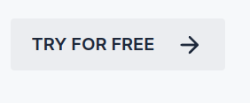

3. [jutsu 편집기](https://jutsu.ai/editor)가 나타나는 것을 확인해주세요.


## 2. 새 컴포넌트 만들기
> jutso에서는 nearpad와 다르게 처음 계정 연동하고 난 뒤에 Create Widget과 Open Widget이 나타나지 않습니다. 1번 과정은 생략해주세요.
~~1. Crerate Widget 버튼을 클릭해주세요.~~

~~~~

## 3. 지갑 연결하기
1. Connect 버튼을 클릭해주세요.


2. 사용할 지갑을 선택해주세요. (ex: NEAR Wallet을 선택)

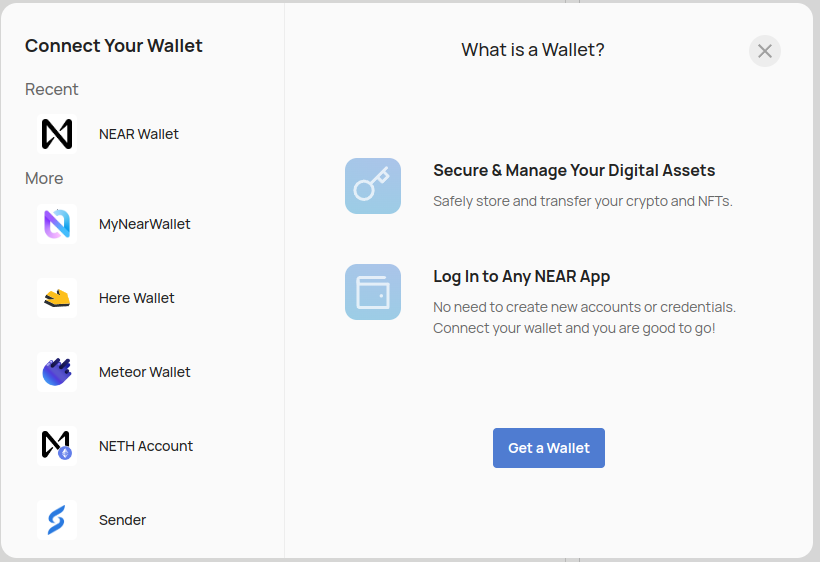

3.Next 버튼을 클릭해주세요

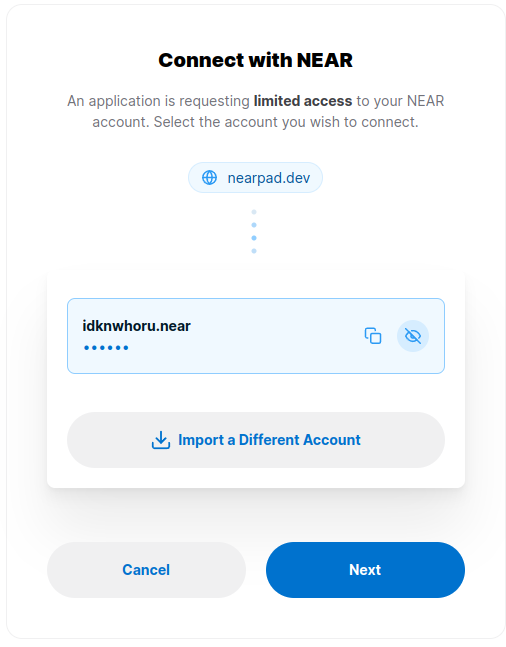

4. Connect 버튼을 클릭해주세요.


## 4. Greeter 위젯을 불러오기
1. search component button을 클릭해주세요.


2. `idknwhoru.near/widget/greeter` 을 검색 해주세요 

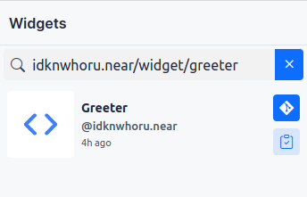

3. fork widget 버튼을 클릭해주세요.


4. Open Widget 목록에 Greeter 위젯이 추가된 것을 확인해주세요.

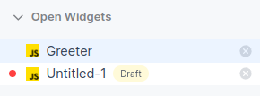

5. Greeter 위젯에 작성된 코드를 확인해주세요.

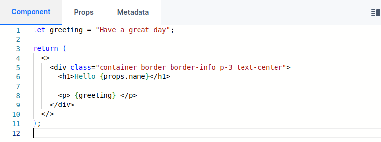

## 5. Greeter 위젯에 Props를 전달하기
1. Props 탭을 선택해주세요.


2. props 에디터에 아래 내용을 추가해주세요.
``` json
{
  "name": "WHORU"
}
```
3. Preview 탭에 표시되는 화면이 바뀐것을 확인해주세요.


## 6. Composition 컴포넌트 만들기
1. Add new button 버튼을 클릭해주세요.


2. 컴포넌트 이름을 Composition으로 변경해주세요.
3. rename 버튼을 클릭해주세요.

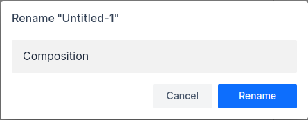

4. 아래 코드를 Composition의 코드에 추가해주세요.
``` jsx
// user의 값은 자신의 지갑 주소를 입력해주세요.
const user = "idknwhoru.near";

return (
  <>
    <h3> Composition </h3>
    <p> Components can be composed </p>
    <hr />
    {/** 자신이 만든 Greeter 컴포넌트를 불러올 수 있습니다. **/}
    <Widget src={`${user}/widget/Greeter`} props={props} />
  </>
);
```

5. Previe에 `Greeter` 위젯이 포함된 컴포지션이 화면에 나타나는지 확인해주세요.

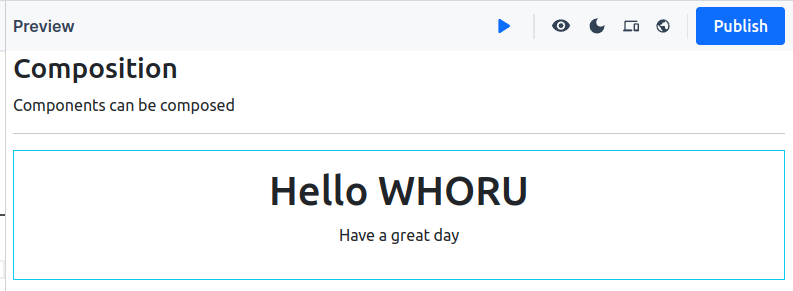 

6. Publish 버튼을 클릭해주세요.


7. Saving data 대화 상자가 나타나는 것을 확인해주세요.

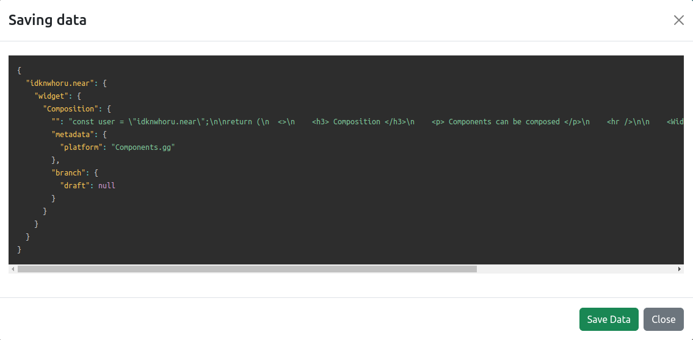

8. Save data 버튼을 클릭해주세요.


9. My Widget에 Composition이 추가된 것을 확인해주세요.

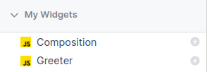

## Mission
- [ ] Greeter 위젯의 이름을 `GreetingYourName`으로 바꿔보세요.

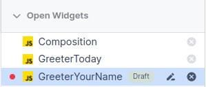

- [ ] `idknwhoru.near/widget/GreeterToday`을 fork 하고 실행 화면을 `Hello Agwn! Today is 07-09-2023` 바꿔보세요.


- [ ] Composition에 포함된 위젯을 `idknwhoru.naer/widget/Greeter`에서 다른 위젯으로 바꿔보세요.(위젯을 검색하는 방법은 4. Greeter 위젯 불러오기와 6. Composition 만들기를 참고)

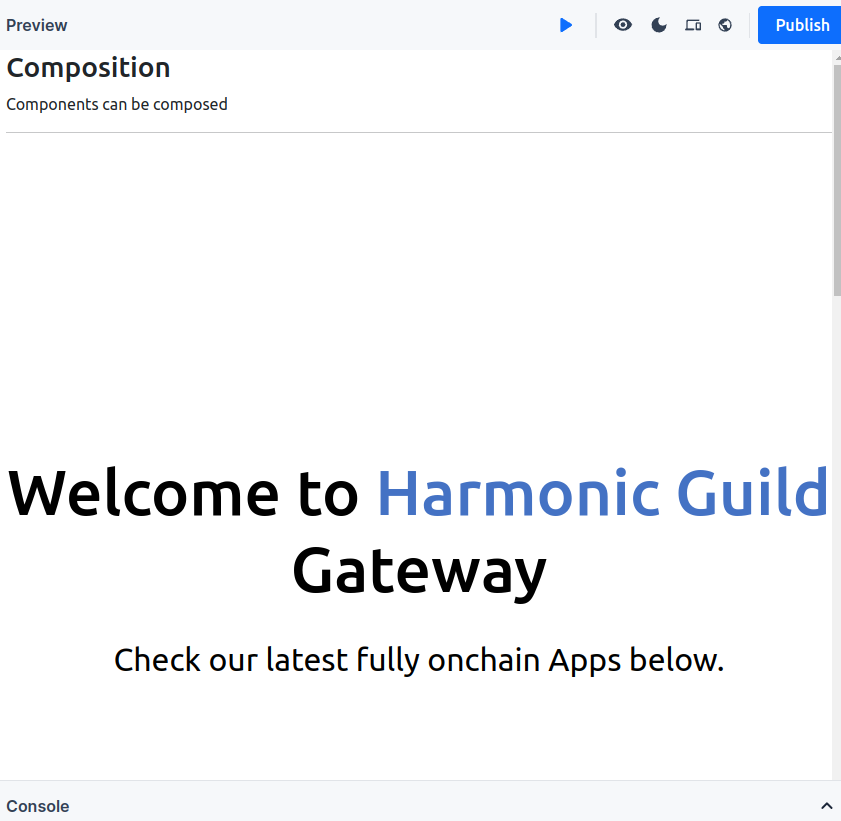
